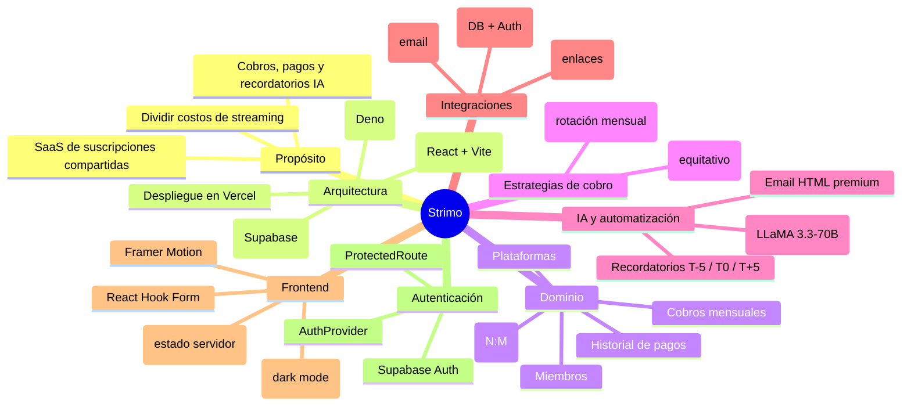
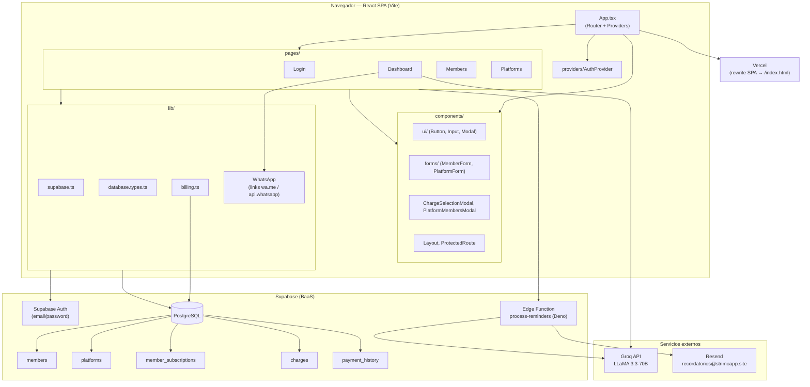
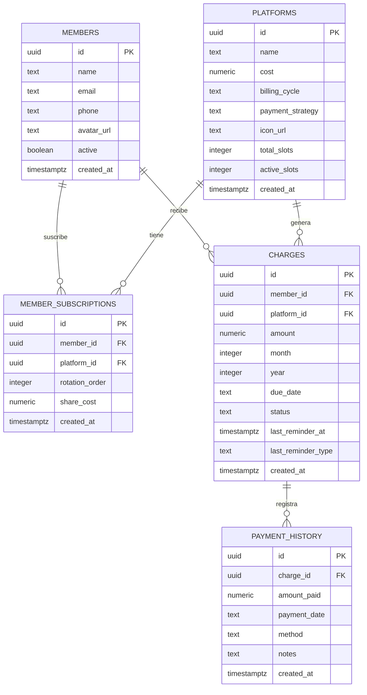
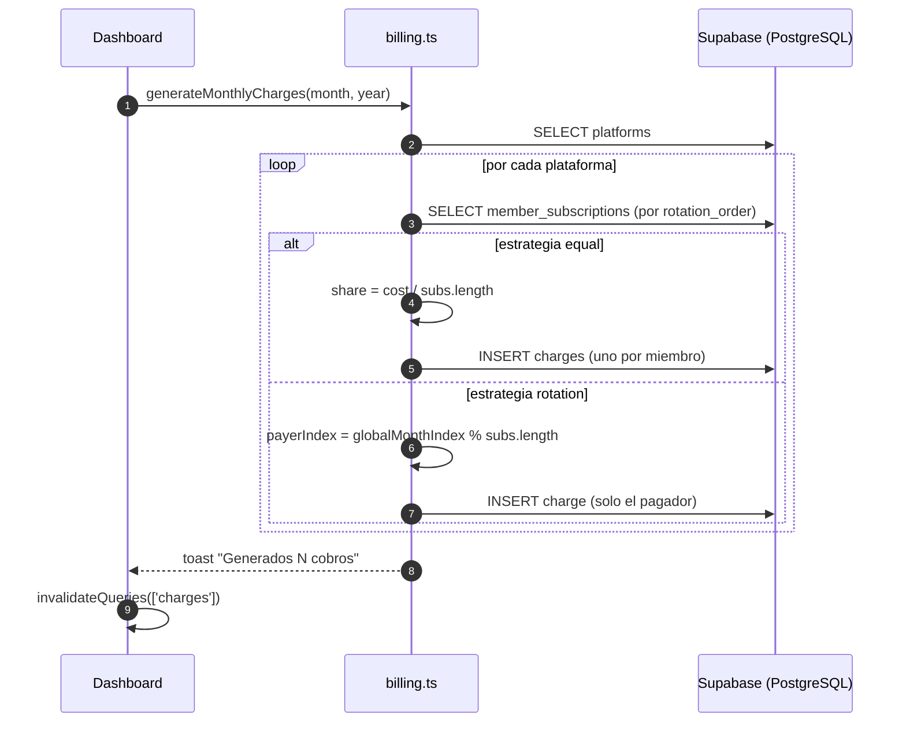
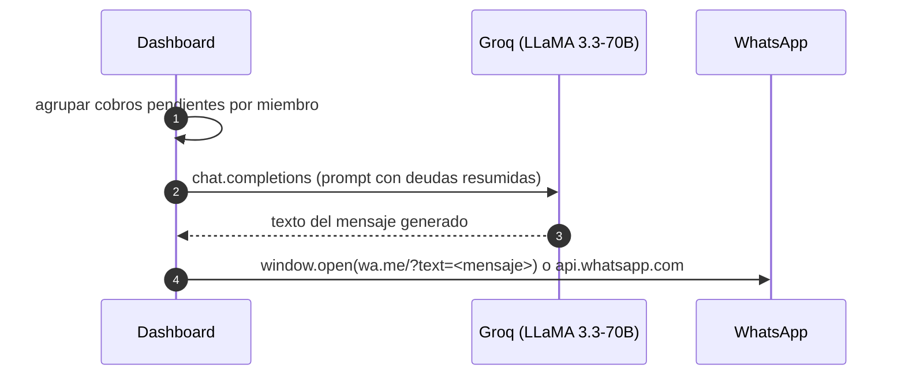
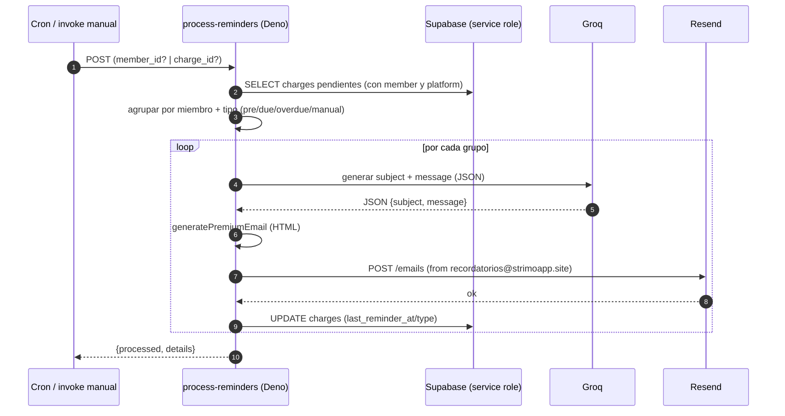
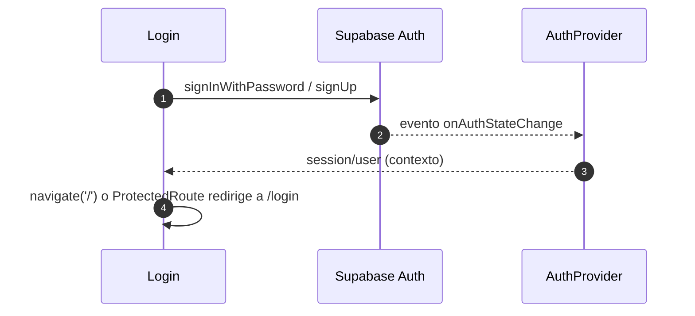

# Arquitectura — Strimo

> **Proyecto:** Strimo (SaaS de suscripciones compartidas)
>
> **Autor:** Cristian Camilo Sabogal López (csabogal)
>
> **Rol:** Ingeniero de Software · Analista de Accesos en Seguros Alfa
>
> **Estado:** Live en [strimoapp.site](https://strimoapp.site/)
>
> **Última actualización:** Agosto 2026

---

## 1. Visión general

**Strimo** es un **SaaS** para gestionar suscripciones compartidas (Netflix, Spotify, HBO, etc.) entre grupos de personas. Divide los costos de forma equitativa o por rotación mensual, genera cobros automáticos, rastrea pagos y envía recordatorios personalizados por **WhatsApp** y **email** usando **IA generativa** (LLaMA 3.3-70B vía Groq).

Arquitectónicamente es un **SPA (Single Page Application)** con **Backend-as-a-Service (BaaS)**:

- **Frontend:** React 19 + TypeScript + Vite, desplegado como estático en Vercel.
- **Backend:** Supabase (PostgreSQL + Autenticación + Edge Functions) — el frontend habla directamente con PostgREST, sin servidor de API propio.
- **Lógica serverless:** una Edge Function en Deno (`process-reminders`) que orquesta recordatorios automáticos por email con IA.
- **Servicios externos:** Groq (IA), Resend (email transaccional) y WhatsApp (enlaces directos).

> [!NOTE]
> Strimo **no tiene backend propio**: la capa de datos y autenticación vive íntegramente en Supabase, y la única lógica de servidor a medida es la Edge Function `process-reminders`. La lógica de negocio de cobros (`billing.ts`) corre en el cliente.

---

## 2. Mapa mental del proyecto



---

## 3. Diagrama de arquitectura



---

## 4. Patrón de diseño y capas

Strimo sigue el patrón **SPA + Backend-as-a-Service**, sin capa de API intermedia:

```text
Componentes React (pages / components)
        ↓  (hooks + React Query)
lib/  (supabase.ts, billing.ts, templates)
        ↓  (PostgREST / SDK)
Supabase (PostgreSQL + Auth)  ·  Edge Functions
        ↓
Servicios externos (Groq, Resend, WhatsApp)
```

- **No hay servidor de API propio:** el SDK de Supabase (`@supabase/supabase-js`) se conecta directamente a PostgreSQL vía PostgREST con el `anon key`.
- **La lógica de negocio vive en `lib/`** (`billing.ts` para cobros, `whatsappTemplate.ts`/`emailTemplate.ts` para mensajes).
- **La única lógica de servidor** es la Edge Function `process-reminders`, escrita en **Deno** y desplegada en Supabase.
- **Estado del servidor:** TanStack React Query gestiona caching, revalidación e invalidación de las queries a Supabase.

---

## 5. Modelo de datos



### Detalle de las tablas

| Tabla | Propósito | Notas |
|-------|-----------|-------|
| `members` | Personas del grupo | `active` permite desactivar sin borrar. |
| `platforms` | Servicios de streaming | `payment_strategy` (`equal`/`rotation`), `total_slots`/`active_slots` para cupos. |
| `member_subscriptions` | Relación N:M miembro-plataforma | `rotation_order` para el turno de pago; `share_cost` para estrategia equitativa. Clave compuesta única `(member_id, platform_id)`. |
| `charges` | Cobros mensuales | `status` (`pending`/`paid`), `due_date`, y `last_reminder_at`/`last_reminder_type` para control de recordatorios. |
| `payment_history` | Historial de pagos | Un registro por cobro pagado, con método y notas. |

**Seguridad:** todas las tablas tienen **Row Level Security (RLS)** habilitada con la política `Allow all for authenticated` (cualquier usuario autenticado puede leer/escribir — apropiado para uso interno de un grupo reducido).

> [!IMPORTANT]
> El archivo `src/lib/database.types.ts` (tipos auto-generados) está **desactualizado**: el tipo `charges` no incluye los campos `last_reminder_at` ni `last_reminder_type`, pese a que la Edge Function y el esquema SQL del README sí los usan. Conviene regenerar los tipos desde Supabase.

---

## 6. Estrategias de cobro

La lógica vive en `src/lib/billing.ts` (`generateMonthlyCharges`):

### 6.1 Equal (equitativo)

```typescript
const share = platform.cost / subs.length
// Cada miembro paga su parte proporcional.
// Se recalcula al agregar/quitar miembros.
```

Genera **un cobro por suscriptor** con `amount = share`.

### 6.2 Rotation (rotación)

```typescript
const globalMonthIndex = (year * 12) + (month - 1)
const payerIndex = globalMonthIndex % subs.length
const payerSub = subs[payerIndex]  // subs ordenado por rotation_order
```

Genera **un único cobro** (costo total) al miembro cuyo turno corresponde al mes, según `rotation_order`. La UI permite reordenar el turno con flechas arriba/abajo (`PlatformMembersModal`).

---

## 7. Flujos principales

### 7.1 Generación de cobros mensuales



### 7.2 Recordatorio IA por WhatsApp (asistido desde el cliente)



### 7.3 Recordatorio automático por email (Edge Function)



### 7.4 Autenticación



---

## 8. Catálogo de módulos

### 8.1 `src/lib/`

| Módulo | Responsabilidad |
|--------|-----------------|
| `supabase.ts` | Cliente Supabase tipado (`createClient<Database>`), valida variables de entorno. |
| `database.types.ts` | Tipos `Row`/`Insert`/`Update` generados (5 tablas). |
| `billing.ts` | Lógica de generación de cobros (estrategias equal/rotation). |
| `whatsappTemplate.ts` | Formatea mensaje WhatsApp con emojis y moneda COP. |
| `emailTemplate.ts` | Plantilla HTML de email (**definida pero sin uso** — ver hallazgos). |

### 8.2 `src/components/`

| Componente | Responsabilidad |
|-----------|-----------------|
| `ui/Button.tsx` | Botón con variantes (`primary`, `secondary`, `danger`, `ghost`, `outline`), `size` y `isLoading`. |
| `ui/Input.tsx` | Input con `label`, `error` y estilos de foco. |
| `ui/Modal.tsx` | Modal animado con Framer Motion (`AnimatePresence`). |
| `forms/MemberForm.tsx` | Formulario crear/editar miembro (React Hook Form). |
| `forms/PlatformForm.tsx` | Formulario crear/editar plataforma (con `select` de estrategia). |
| `Layout.tsx` | Sidebar desktop + bottom nav mobile + fondo decorativo + firma. |
| `ProtectedRoute.tsx` | Guard de autenticación (redirige a `/login` si no hay sesión). |
| `ChargeSelectionModal.tsx` | Selección de cobros a pagar/enviar por WhatsApp. |
| `PlatformMembersModal.tsx` | Gestión de miembros por plataforma (cupos + reordenamiento de rotación). |

### 8.3 `src/pages/`

| Página | Ruta | Responsabilidad |
|--------|------|-----------------|
| `Login.tsx` | `/login` | Login/registro con Supabase Auth. |
| `Dashboard.tsx` | `/` | Métricas, cobros pendientes agrupados, IA de cobranza, pagos y envío de correos. |
| `Members.tsx` | `/members` | CRUD de miembros. |
| `Platforms.tsx` | `/platforms` | CRUD de plataformas y gestión de cupos. |

### 8.4 `src/providers/`

| Provider | Responsabilidad |
|----------|-----------------|
| `AuthProvider.tsx` | Contexto de autenticación: `session`, `user`, `loading`, `signOut`; expone el hook `useAuth()`. |

### 8.5 Edge Function

| Función | Runtime | Responsabilidad |
|---------|---------|-----------------|
| `supabase/functions/process-reminders/index.ts` | Deno | Recordatorios automáticos por email con IA (Groq) vía Resend. |

---

## 9. Rutas de la aplicación

| Ruta | Página | Acceso |
|------|--------|--------|
| `/login` | Login/Registro | Público |
| `/` | Dashboard | Protegido |
| `/members` | Gestión de miembros | Protegido |
| `/platforms` | Gestión de plataformas | Protegido |
| `*` | Redirect a `/` | Protegido |

---

## 10. Estado del servidor (React Query)

| Query Key | Datos |
|-----------|-------|
| `['members']` | Todos los miembros. |
| `['platforms']` | Todas las plataformas. |
| `['charges', 'pending']` | Cobros pendientes (con `members` y `platforms` anidados). |
| `['subscriptions', platformId]` | Suscripciones de una plataforma. |
| `['payment_history']` | Últimos 5 pagos (con relaciones). |

Las mutaciones (crear/editar/eliminar/pagar) usan `invalidateQueries` para refrescar las queries afectadas.

---

## 11. Integraciones externas

| Servicio | Uso | Detalle |
|----------|-----|---------|
| **Supabase** | DB + Auth + Edge Functions | Cliente tipado en `lib/supabase.ts`. |
| **Groq** | IA generativa | Modelo `llama-3.3-70b-versatile`. Usado desde el cliente (`groq-sdk`) y desde la Edge Function (REST). |
| **Resend** | Email transaccional | Remitente `recordatorios@strimoapp.site`. |
| **WhatsApp** | Enlaces directos | `https://api.whatsapp.com/send?phone=...` y `https://wa.me/?text=...`. |

### Variables de entorno

| Variable | Alcance | Obligatoria |
|----------|---------|-------------|
| `VITE_SUPABASE_URL` | Cliente | Sí |
| `VITE_SUPABASE_ANON_KEY` | Cliente | Sí |
| `VITE_GROQ_API_KEY` | Cliente | Sí (para IA de cobranza) |
| `VITE_RESEND_API_KEY` | Cliente | No (definida, sin uso en cliente) |
| `GROQ_API_KEY`, `RESEND_API_KEY`, `SUPABASE_URL`, `SUPABASE_SERVICE_ROLE_KEY` | Edge Function (secrets) | Sí |

---

## 12. Edge Function: process-reminders

Lógica de recordatorios automáticos:

1. Consulta cobros pendientes (`status = 'pending'`).
2. Si recibe `member_id` o `charge_id` (modo manual), consolida **todos** los cobros de ese miembro.
3. En modo automático, calcula la diferencia de días con `due_date`:
   - `pre` = faltan 5 días.
   - `due` = vence hoy.
   - `overdue` = atrasado 5 días.
   - Evita reenviar si `last_reminder_type` coincide.
4. Genera `subject` + `message` con Groq (formato JSON estricto).
5. Construye el HTML premium (`generatePremiumEmail`) con tabla de cobros y total.
6. Envía vía Resend desde `recordatorios@strimoapp.site`.
7. Actualiza `last_reminder_at` y `last_reminder_type`.

**Modos de invocación:** cron programado (modo automático) o `supabase.functions.invoke('process-reminders', { body: { member_id } })` desde el Dashboard (modo manual).

---

## 13. Deployment

Despliegue en **Vercel** como sitio estático:

- `vercel.json`: build `npm run build`, salida `dist`, framework `vite`, y **rewrite** `/(.*) → /index.html` para soportar rutas del SPA.
- `vite.config.ts`: plugin React, `server.host = true`.
- Comandos: `npm run dev`, `npm run build` (`tsc -b && vite build`), `npm run preview`, `npm run lint`.

---

## 14. Estructura de archivos

```text
Strimo/
├── src/
│   ├── components/
│   │   ├── ui/            # Button, Input, Modal
│   │   ├── forms/         # MemberForm, PlatformForm
│   │   ├── Layout.tsx
│   │   ├── ProtectedRoute.tsx
│   │   ├── ChargeSelectionModal.tsx
│   │   └── PlatformMembersModal.tsx
│   ├── pages/             # Login, Dashboard, Members, Platforms
│   ├── providers/         # AuthProvider
│   ├── lib/               # supabase, database.types, billing, emailTemplate, whatsappTemplate
│   ├── hooks/             # (vacío, reservado)
│   ├── assets/
│   ├── App.tsx            # Router principal + providers
│   ├── main.tsx           # Entry point
│   └── index.css          # @import "tailwindcss"
├── supabase/
│   └── functions/process-reminders/index.ts   # Edge Function (Deno)
├── public/                # Assets estáticos
├── vercel.json            # Configuración Vercel
├── vite.config.ts
├── tailwind.config.js
├── tsconfig.json / tsconfig.app.json / tsconfig.node.json
├── eslint.config.js
├── postcss.config.js
├── index.html
└── package.json
```

---

## 15. Decisiones, convenciones y hallazgos

### Decisiones de arquitectura

- **SPA + BaaS (Supabase):** elimina la necesidad de un backend propio; el frontend usa PostgREST directamente.
- **React Query** como única fuente de verdad del estado del servidor (sin estado global tipo Redux).
- **Lógica de negocio en `lib/`** y no en los componentes, manteniendo las páginas como orquestadores de UI.
- **IA desde dos frentes:** en el cliente (mensaje de grupo para WhatsApp) y en la Edge Function (emails personalizados automáticos).
- **Dark mode fijo** con glassmorphism y gradientes indigo/violet; mobile-first con touch targets ≥ 44px.
- **Moneda COP** con `Intl.NumberFormat('es-CO')` en todo el proyecto.

### Hallazgos verificados

1. **Dependencia muerta `@google/generative-ai`:** está en `package.json` pero no se importa en ningún archivo. El proyecto migró a Groq (commit "Cambio de IA por groq") y quedó el paquete residual.
2. **`src/lib/emailTemplate.ts` sin uso:** la función `generateEmailHTML` está definida pero nunca se importa. La Edge Function define su propio `generatePremiumEmail` en línea.
3. **`database.types.ts` desactualizado:** el tipo `charges` no incluye `last_reminder_at`/`last_reminder_type`, que sí usan la Edge Function y el esquema SQL.
4. **`index.html` con `lang="en"`** aunque toda la UI está en español.
5. **`VITE_RESEND_API_KEY`** está declarada en `.env.local`/documentación pero no se usa en el cliente (los emails los envía solo la Edge Function con su propio secret).

### Convenciones de código

- **TypeScript estricto** (`strict`, `noUnusedLocals`, `noUnusedParameters`).
- **Componentes con named exports** (`export const X = ...`).
- **Interfaces sobre types** en props de componentes.
- **UI en español** en todos los textos, toasts y mensajes.
